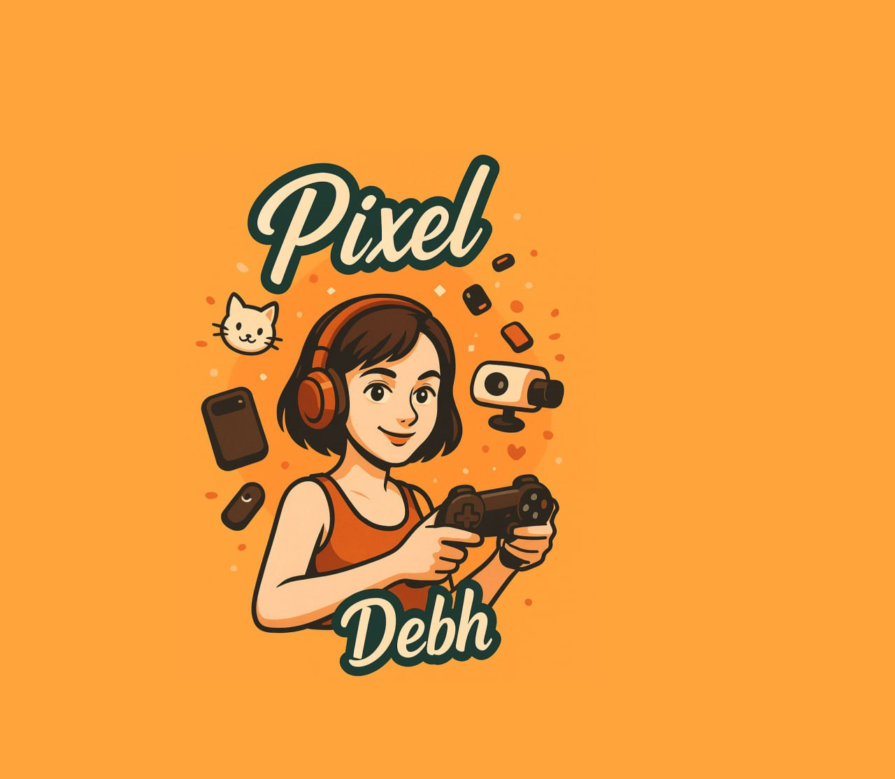

# PixelDebh's Retro Rescue 🎮

Un videogioco arcade browser-based sviluppato con **Phaser 3** che celebra la storia del videogioco attraverso un'avventura platform single-screen in stile retrò.



## 📖 Descrizione

PixelDebh's Retro Rescue è un gioco arcade dove la protagonista PixelDebh deve salvare la storia del videogioco dall'**Oblio Digitale** raccogliendo oggetti iconici (floppy disk, cartucce, CD, computer e console vintage) mentre evita la temibile **Glitch Army**. Il gioco attraversa tre ere videoludiche distinte—8-bit, 16-bit e 32/64-bit—con 9 livelli progressivamente più difficili caratterizzati da labirinti complessi in stile Pac-Man.

### Caratteristiche Principali

Il gioco offre un'esperienza arcade completa con meccaniche ben bilanciate e una progressione di difficoltà studiata. Ogni livello presenta layout di labirinti unici generati proceduralmente, garantendo varietà e sfida strategica. Il sistema di power-up include quattro potenziamenti distinti che modificano temporaneamente le abilità del giocatore, mentre cinque tipi di nemici con intelligenza artificiale differenziata richiedono approcci tattici diversi.

L'interfaccia utente mostra in tempo reale punteggio, vite rimanenti, livello corrente e contatore oggetti da raccogliere. Il sistema di salvataggio automatico degli high score in localStorage permette di tracciare i propri progressi nel tempo. La grafica pixel art procedurale e gli effetti sonori generati con Web Audio API creano un'atmosfera nostalgica perfettamente in linea con il tema retrò del gioco.

## 🎯 Obiettivo del Gioco

L'obiettivo principale è raccogliere tutti gli oggetti da collezione presenti in ogni livello evitando i nemici della Glitch Army. Ogni oggetto ha un valore in punti diverso, con gli oggetti rari (computer e console) che valgono significativamente di più. Il giocatore inizia con 3 vite e perde una vita ogni volta che viene colpito da un nemico. Il gioco termina quando tutte le vite sono esaurite.

## 🕹️ Controlli

Il gioco supporta due schemi di controllo per massima accessibilità:

- **WASD**: Movimento in quattro direzioni (W=su, A=sinistra, S=giù, D=destra)
- **Frecce direzionali**: Movimento alternativo
- **P**: Pausa/Riprendi gioco
- **SPAZIO**: Conferma nei menu, skip intro
- **ESC**: Skip intro, torna al menu da game over

## 🎮 Meccaniche di Gioco

### Oggetti da Collezione

Il gioco presenta cinque categorie di oggetti da raccogliere, ciascuna con valore e rarità differenti:

| Oggetto | Punti | Rarità | Descrizione |
|---------|-------|--------|-------------|
| Floppy Disk | 10 | Comune | Supporto di archiviazione dell'era 8-bit |
| Cartuccia | 15 | Comune | Cartucce NES/SNES/Mega Drive |
| CD | 20 | Comune | CD PlayStation/Saturn dell'era 32-bit |
| Computer | 50 | Raro | Commodore 64, Amiga e altri computer storici |
| Console | 100 | Molto Raro | Atari, Game Boy, Neo Geo e console iconiche |

### Nemici della Glitch Army

Cinque tipi di nemici con comportamenti unici popolano i livelli:

**Glitch** (rosa) si muove in pattern prevedibili orizzontali, ideale per essere evitato con tempismo preciso. **Bug** (verde) insegue attivamente il giocatore usando pathfinding intelligente, richiedendo manovre evasive costanti. **Lag** (giallo) si muove a scatti imprevedibili, apparendo e scomparendo in posizioni casuali. **DRM-one** (grigio) è invincibile e si muove lentamente ma inesorabilmente, creando zone di pericolo permanente. **Hater** (rosso scuro) lancia proiettili rallentanti che riducono temporaneamente la velocità del giocatore.

### Power-ups

Quattro power-up possono essere raccolti durante il gioco per ottenere vantaggi temporanei:

- ☕ **Tazzina di Caffè**: Aumenta la velocità di movimento per 10 secondi
- 🎮 **Joystick d'Oro**: Invincibilità completa per 8 secondi (elimina nemici al tocco)
- 🫧 **Bolla Retrò**: Scudo protettivo che assorbe un colpo nemico
- 📺 **Tubo Catodico**: Stordisce tutti i nemici sullo schermo per 5 secondi

### Livelli e Progressione

Il gioco è strutturato in 9 livelli divisi in tre ere videoludiche:

**Era 8-Bit** (Livelli 1-3) presenta labirinti semplici con pochi nemici e introduce gradualmente le meccaniche base. Lo sfondo utilizza tonalità blu scure profonde tipiche dei giochi NES.

**Era 16-Bit** (Livelli 4-6) aumenta la complessità con labirinti più articolati, più nemici e l'introduzione di tutti i tipi di power-up. Lo sfondo passa a tonalità viola e magenta reminiscenti dell'era SNES.

**Era 32/64-Bit** (Livelli 7-9) offre la massima sfida con labirinti complessi stile Pac-Man, numerosi nemici veloci e spawn limitati di power-up. Lo sfondo utilizza gradienti ciano e verde acqua dell'era PlayStation.

Ogni livello ha un layout di labirinto unico generato proceduralmente, garantendo che non ci siano due partite identiche. La difficoltà aumenta progressivamente attraverso velocità nemici maggiorata, numero crescente di avversari e layout di labirinti sempre più complessi.

## 🛠️ Stack Tecnologico

Il progetto utilizza tecnologie moderne per garantire prestazioni ottimali e manutenibilità del codice:

### Frontend
- **React 19**: Framework UI per gestione componenti e stato
- **TypeScript**: Type safety e migliore developer experience
- **Phaser 3.90.0**: Game engine per rendering canvas e fisica arcade
- **Vite**: Build tool ultra-veloce con Hot Module Replacement
- **Tailwind CSS 4**: Utility-first CSS framework

### Architettura Gioco
- **Scene-based architecture**: Separazione logica tra Intro, Menu, Game e GameOver
- **Component pattern**: Sprite generator, sound manager, level generator modulari
- **Data-driven design**: Configurazione livelli centralizzata in LevelData.ts
- **Procedural generation**: Labirinti e sprite generati algoritmicamente

### Storage
- **localStorage**: Persistenza high score lato client con top 10 punteggi
- **JSON serialization**: Salvataggio strutturato dati di gioco

## 📦 Installazione e Avvio

### Prerequisiti

Assicurati di avere installato:
- **Node.js** 22.x o superiore
- **pnpm** (package manager consigliato)

### Setup Progetto

```bash
# Clone del repository
git clone https://github.com/tuousername/pixeldebh-arcade.git
cd pixeldebh-arcade

# Installazione dipendenze
pnpm install

# Avvio server di sviluppo
pnpm dev
```

Il gioco sarà accessibile all'indirizzo `http://localhost:3000`

### Build per Produzione

```bash
# Genera build ottimizzata
pnpm build

# Preview build di produzione
pnpm preview
```

### Script Disponibili

- `pnpm dev`: Avvia server di sviluppo con HMR
- `pnpm build`: Compila il progetto per produzione
- `pnpm preview`: Serve la build di produzione localmente
- `pnpm lint`: Esegue ESLint sul codice
- `pnpm type-check`: Verifica i tipi TypeScript

## 🏗️ Struttura del Progetto

```
pixeldebh-arcade/
├── client/
│   ├── public/               # Asset statici
│   │   └── PixelDebh.jpg    # Logo del gioco
│   ├── src/
│   │   ├── components/       # Componenti React
│   │   │   ├── Game.tsx     # Wrapper Phaser in React
│   │   │   └── ui/          # Componenti shadcn/ui
│   │   ├── game/            # Logica gioco Phaser
│   │   │   ├── config.ts    # Configurazione Phaser
│   │   │   ├── data/
│   │   │   │   └── LevelData.ts      # Dati livelli
│   │   │   ├── scenes/
│   │   │   │   ├── IntroScene.ts     # Intro animata
│   │   │   │   ├── MenuScene.ts      # Menu principale
│   │   │   │   ├── GameScene.ts      # Scena di gioco
│   │   │   │   └── GameOverScene.ts  # Game over
│   │   │   └── utils/
│   │   │       ├── SpriteGenerator.ts    # Generazione sprite
│   │   │       ├── SoundManager.ts       # Gestione audio
│   │   │       ├── LevelGenerator.ts     # Generazione labirinti
│   │   │       └── HighScoreManager.ts   # Gestione punteggi
│   │   ├── pages/           # Pagine React
│   │   │   └── Home.tsx
│   │   ├── App.tsx          # App React principale
│   │   ├── main.tsx         # Entry point
│   │   └── index.css        # Stili globali
│   └── index.html           # HTML template
├── README.md                # Questo file
├── CONTRIBUTING.md          # Linee guida contribuzione
├── LICENSE                  # Licenza MIT
├── ANALISI_CRITICA.md       # Analisi tecnica del codice
├── todo.md                  # Task tracker del progetto
└── package.json             # Dipendenze progetto
```

## 🎨 Design e Asset

Tutti gli asset grafici e sonori sono generati proceduralmente in runtime utilizzando le API di Phaser e Web Audio. Questo approccio garantisce dimensioni ridotte del bundle (< 500KB gzipped) e massima personalizzabilità.

### Sprite Generation

Gli sprite sono creati utilizzando `Phaser.GameObjects.Graphics` con forme geometriche primitive e colori definiti. Ogni sprite viene generato una volta all'avvio nella `preload()` e convertito in texture riutilizzabile per prestazioni ottimali. Lo sprite di PixelDebh include dettagli come occhi espressivi, cuffie con archetto, controller con pulsanti colorati e proporzioni fedeli al logo originale.

### Sound Design

Gli effetti sonori utilizzano oscillatori Web Audio con forme d'onda sinusoidali, quadrate e triangolari per creare suoni retrò autentici. Ogni azione di gioco (raccolta oggetto, power-up, colpo nemico, completamento livello) ha un feedback audio distintivo generato algoritmicamente senza file audio esterni.

### Font Typography

Il gioco utilizza il font **Press Start 2P** di Google Fonts per tutti i testi, garantendo un'estetica pixel-perfect coerente con il tema arcade anni '80. Il font è caricato tramite CDN per prestazioni ottimali.

## 🤝 Contribuire

Contribuzioni sono benvenute! Per favore leggi [CONTRIBUTING.md](./CONTRIBUTING.md) per dettagli sul nostro processo di sviluppo e come sottomettere pull request.

### Aree di Contribuzione

- **Nuovi livelli**: Design di layout labirinti aggiuntivi o livelli bonus
- **Nemici**: Implementazione di nuovi tipi con AI unica
- **Power-ups**: Creazione di potenziamenti innovativi
- **Localizzazione**: Traduzione interfaccia in altre lingue (EN, ES, FR, DE)
- **Ottimizzazioni**: Miglioramenti performance e riduzione bundle size
- **Testing**: Scrittura test unitari e e2e con Vitest/Playwright
- **Documentazione**: Miglioramenti a README, guide e commenti codice

### Processo di Contribuzione

1. Fork del repository
2. Crea un branch per la tua feature (`git checkout -b feature/AmazingFeature`)
3. Commit delle modifiche (`git commit -m 'Add some AmazingFeature'`)
4. Push al branch (`git push origin feature/AmazingFeature`)
5. Apri una Pull Request

## 🧪 Testing

Il progetto include test per garantire stabilità e qualità del codice:

```bash
# Esegui test unitari
pnpm test

# Test con coverage
pnpm test:coverage

# Test e2e
pnpm test:e2e
```

## 📝 Licenza

Questo progetto è rilasciato sotto licenza **MIT**. Vedi il file [LICENSE](./LICENSE) per dettagli completi.

## 👤 Autore

**PixelDebh** - Content Creator e Game Designer  
Sviluppato con ❤️ utilizzando **Manus AI**

## 🙏 Ringraziamenti

- **Phaser Team** per l'eccellente game engine open source
- **Photon Storm** per la documentazione e gli esempi Phaser
- **Comunità Retro Gaming** per l'ispirazione continua
- **Google Fonts** per il font Press Start 2P
- **shadcn/ui** per i componenti UI React

## 📞 Supporto

Per bug report, richieste di feature o domande:
- Apri una [Issue su GitHub](https://github.com/tuousername/pixeldebh-arcade/issues)
- Contatta PixelDebh sui social media
- Consulta la [documentazione Phaser](https://phaser.io/docs)

## 🎯 Roadmap

### v1.1 (Prossima Release)
- [ ] Livelli bonus a tempo
- [ ] Modalità endless con difficoltà infinita
- [ ] Leaderboard online con backend
- [ ] Controlli touch ottimizzati per mobile
- [ ] Musica di sottofondo per ogni era

### v2.0 (Futuro)
- [ ] Modalità multiplayer locale
- [ ] Editor livelli personalizzati
- [ ] Achievement system
- [ ] Skin alternative per PixelDebh
- [ ] Boss fight alla fine di ogni era

## 📊 Statistiche Progetto

- **Linee di codice**: ~2,500
- **File TypeScript**: 15+
- **Componenti React**: 5
- **Scene Phaser**: 4
- **Sprite unici**: 20+
- **Effetti sonori**: 8
- **Bundle size** (gzipped): < 500KB

---

**Buon divertimento e salva la storia del videogioco! 🎮✨**
